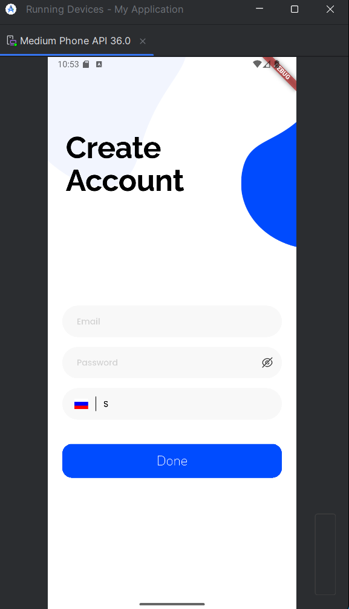
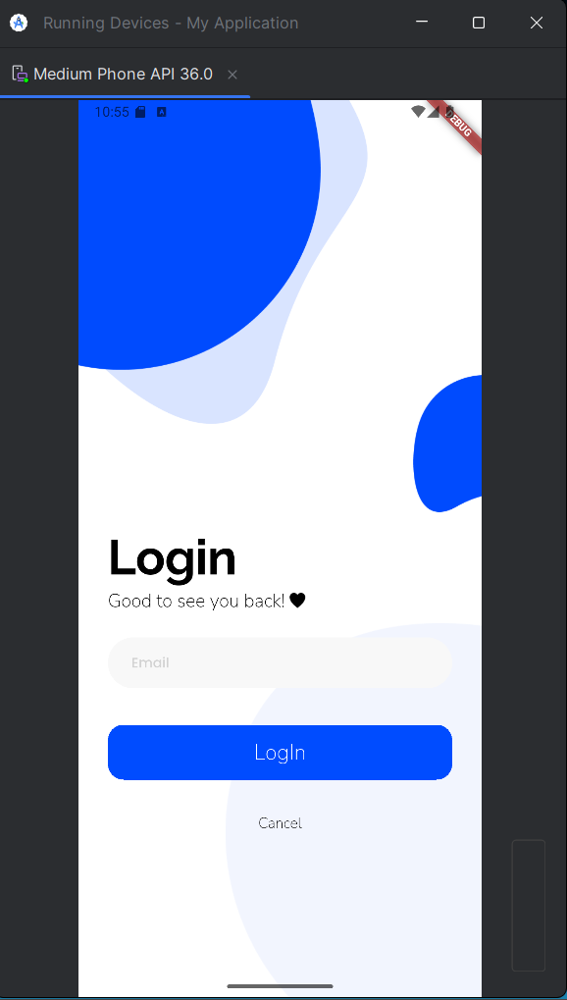
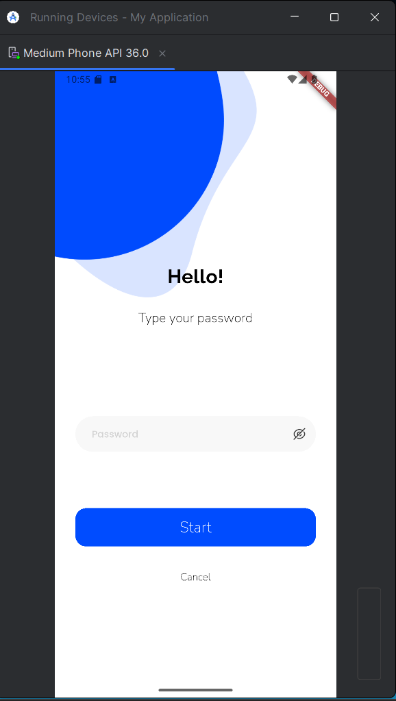
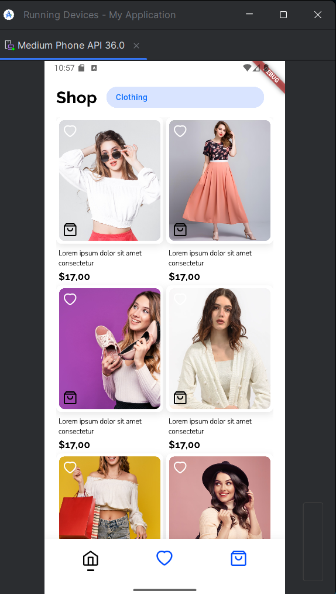
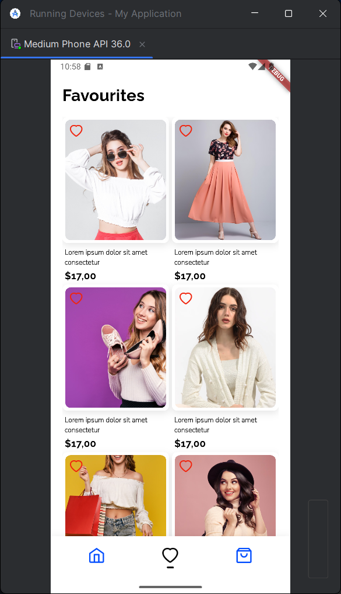
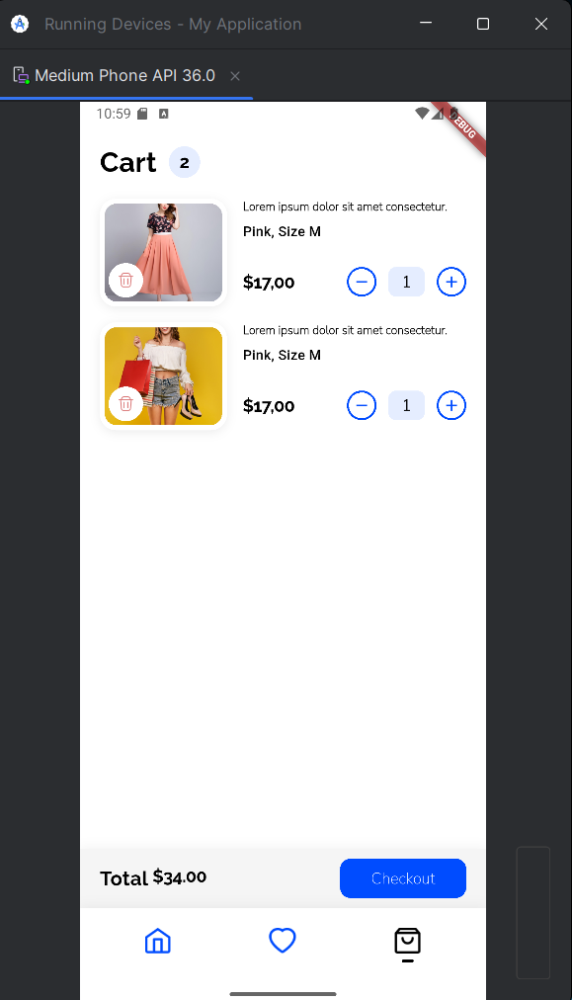

# MAD Shop - Flutter E-Commerce App

Мобильное приложение интернет-магазина одежды(макет), разработанное на Flutter.

## 📱 Скриншоты

### Все экраны приложения

<p float="left">
  
  
  
  
  
  
</p>

**Splash Screen** - стартовый экран приложения с логотипом и анимацией загрузки.

**Create Account Screen** - экран регистрации нового пользователя с полями для ввода данных и выбором страны.

**Login Screen** - экран входа с полем для ввода email и декоративными элементами дизайна.

**Password Screen** - экран ввода пароля с возможностью показать/скрыть введённый пароль.

**Shop Screen** - каталог товаров с фильтром по категориям, возможностью добавления в избранное и корзину.

**Favourites Screen** - список избранных товаров с возможностью удаления из избранного.

**Cart Screen** - корзина с выбранными товарами, регулировкой количества и расчётом итоговой суммы.

## 🛠 Технологии

- **Flutter** - фреймворк для разработки
- **Dart** - язык программирования
- **Material Design** - дизайн система

## 📂 Структура проекта
```
lib/
├── screens/           # Экраны приложения
│   ├── splash_screen.dart
│   ├── create_account_screen.dart
│   ├── login_screen.dart
│   ├── password_screen.dart
│   ├── shop_screen.dart
│   ├── favourites_screen.dart
│   └── cart_screen.dart
├── widgets/           # Переиспользуемые виджеты
│   ├── product_card.dart
│   └── cart_item_card.dart
├── theme/            # Тема приложения
│   ├── app_colors.dart
│   └── text_styles.dart
└── main.dart         # Точка входа
```


## 🚀 Запуск проекта

### Предварительные требования
Убедитесь, что у вас установлены Flutter SDK версии 3.0.0 или выше и Dart SDK версии 3.0.0 или выше. Для проверки установки выполните команду flutter doctor в терминале. Эта команда покажет статус установки Flutter и всех необходимых зависимостей.

### Шаг 1: Клонирование репозитория
Склонируйте репозиторий проекта на ваш локальный компьютер используя Git. Откройте терминал и выполните команду git clone с URL вашего репозитория, затем перейдите в директорию проекта командой cd madshop_ui_zhirnoff.

### Шаг 2: Установка зависимостей
После клонирования репозитория необходимо установить все зависимости проекта. В директории проекта выполните команду flutter pub get. Эта команда загрузит и установит все пакеты, указанные в файле pubspec.yaml.

### Шаг 3: Проверка подключенных устройств
Перед запуском приложения убедитесь, что у вас подключено устройство или запущен эмулятор. Выполните команду flutter devices чтобы увидеть список доступных устройств. Если список пуст, запустите эмулятор Android через Android Studio или симулятор iOS через Xcode (только на macOS).

### Шаг 4: Запуск приложения
Для запуска приложения на подключенном устройстве или эмуляторе выполните команду flutter run в терминале. Flutter автоматически скомпилирует приложение и установит его на выбранное устройство. Процесс первого запуска может занять несколько минут.

### Шаг 5: Hot Reload (опционально)
После успешного запуска приложения вы можете использовать функцию Hot Reload для мгновенного обновления изменений в коде. Просто нажмите клавишу r в терминале, где запущено приложение, чтобы перезагрузить изменения без перезапуска всего приложения. Для полного перезапуска приложения нажмите R (заглавная).

### Альтернативный способ запуска
Вы также можете запустить приложение напрямую из Android Studio или Visual Studio Code. В Android Studio откройте проект, выберите устройство в верхней панели и нажмите кнопку Run (зеленый треугольник). В VS Code откройте проект, выберите устройство в нижнем правом углу и нажмите F5 или используйте меню Run > Start Debugging.

### Сборка релизной версии
Для создания релизной версии приложения для Android выполните команду flutter build apk для создания APK файла или flutter build appbundle для создания Android App Bundle. Для iOS (только на macOS) выполните команду flutter build ios. Готовые файлы будут находиться в директории build/app/outputs/.

## 📋 Требования

- Flutter SDK: >=3.0.0
- Dart SDK: >=3.0.0
- iOS 12.0+ / Android 5.0+
- Android Studio или VS Code с Flutter плагином
- Xcode (для iOS, только macOS)